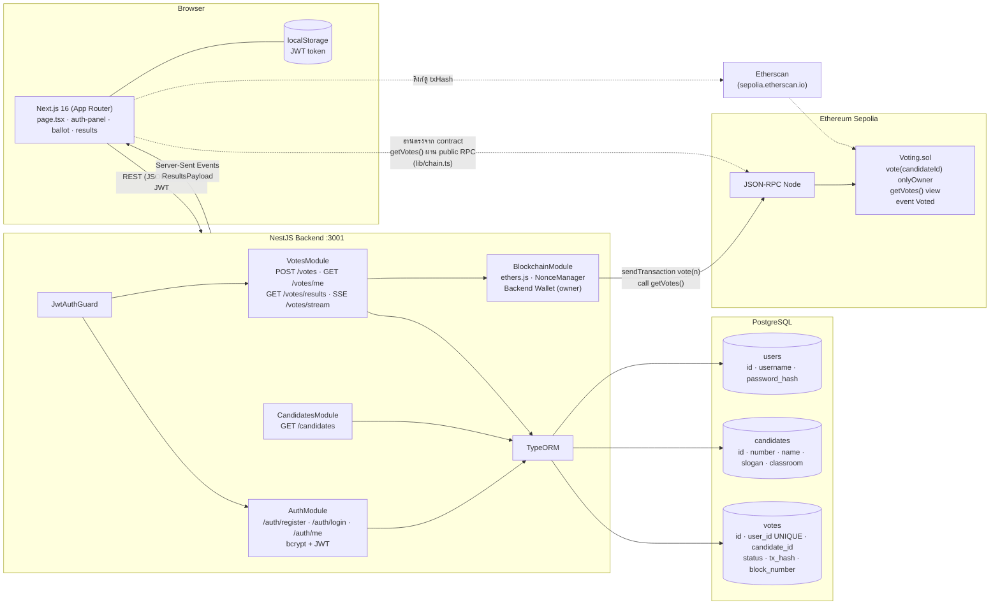
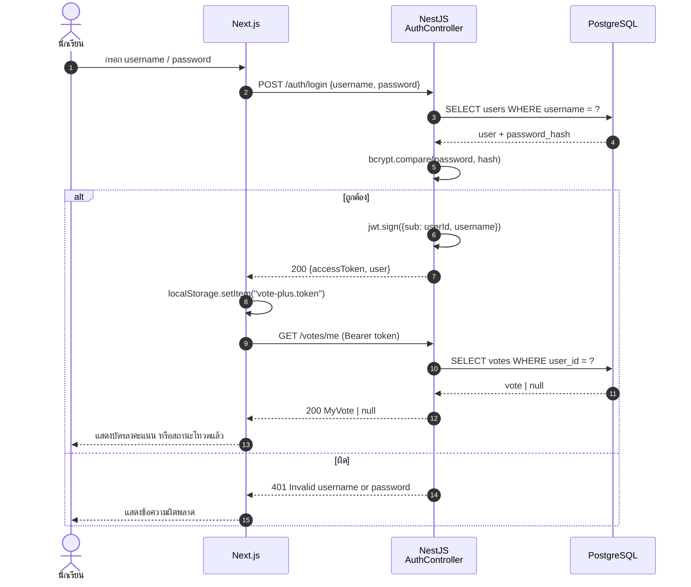
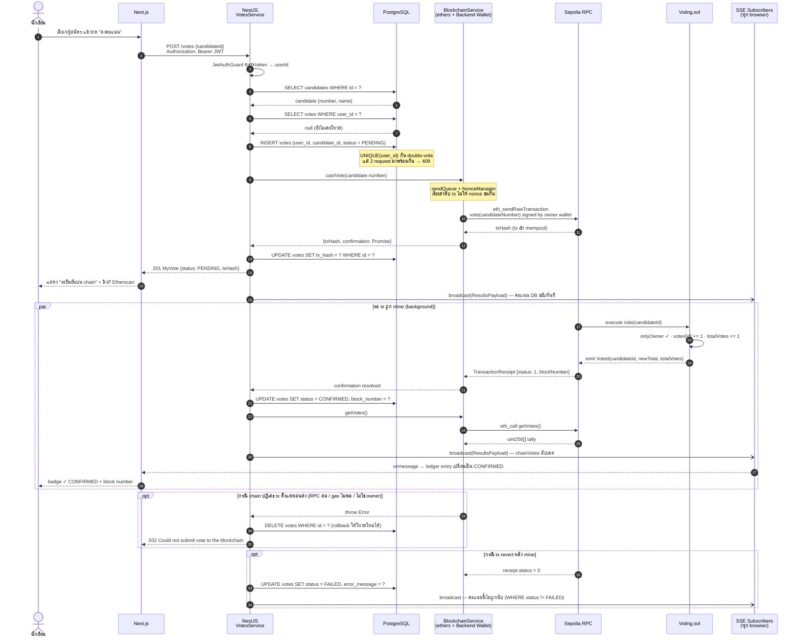
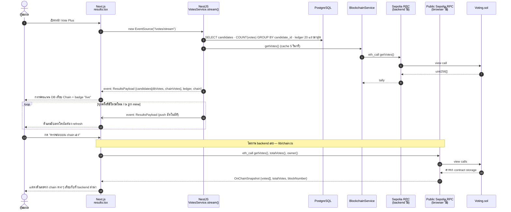

# Vote Plus — Architecture & Sequence Diagrams

ระบบเลือกตั้งประธานนักเรียนแบบ **Web 2.5**: ตัวตนผู้ใช้และกติกา "1 คน 1 เสียง" อยู่ใน PostgreSQL (Web 2) ส่วนคะแนนรวมถูกบันทึกซ้ำบน Smart Contract บน Ethereum Sepolia (Web 3) เพื่อเป็นหลักฐานสาธารณะที่แก้ไขไม่ได้

---

## 1. Architecture Diagram

**คำอธิบายสั้น ๆ**

| ชั้น | หน้าที่ |
|---|---|
| **Next.js (Frontend)** | หน้าเดียวรวม Login/Register, บัตรลงคะแนน (5 ผู้สมัคร), ผลคะแนน real-time ผ่าน SSE และปุ่มตรวจสอบคะแนนบน chain ตรงจาก browser โดยไม่ผ่าน backend |
| **NestJS (Backend)** | ตรวจตัวตน (JWT), บังคับ 1 คน 1 เสียง, เขียน PostgreSQL แล้วส่ง tx ไปยัง contract ด้วย wallet ของ backend (เป็น `owner` ของ contract) และ broadcast ผลผ่าน SSE |
| **PostgreSQL** | Source of truth ว่า "ใครโหวตแล้ว" — `votes.user_id UNIQUE` กัน double-vote แม้เกิด race |
| **Smart Contract** | นับคะแนนแบบ increment-only, มีแค่ `owner` เรียก `vote()` ได้, `getVotes()` เป็น `view` ใครก็อ่านได้ฟรี |

---

## 2. Sequence Diagram — Login / Register

---

## 3. Sequence Diagram — Cast Vote (หัวใจของระบบ Web 2.5)

---

## 4. Sequence Diagram — Live Results (SSE) และการตรวจสอบตรงจาก Chain

---

## สรุปแนวคิด Web 2.5

- **Web 2 (PostgreSQL)** ตอบคำถาม *"ใครโหวตแล้ว"* — ต้องมีตัวตน, ต้องกันโหวตซ้ำ, ต้องรวดเร็ว
- **Web 3 (Smart Contract)** ตอบคำถาม *"คะแนนรวมถูกแก้หรือไม่"* — ใครก็อ่านได้, ไม่มีใครลดคะแนนได้ แม้แต่ owner
- Backend เป็นตัวกลางที่ถือ private key ฝั่งเดียว นักเรียนไม่ต้องมี wallet / จ่าย gas เอง จึงใช้งานง่ายเหมือนเว็บทั่วไป แต่ยังตรวจสอบย้อนหลังได้ผ่าน Etherscan หรือเรียก `getVotes()` ตรงจาก browser
- ถ้าไม่ตั้งค่า `RPC_URL / BACKEND_WALLET_PRIVATE_KEY / VOTING_CONTRACT_ADDRESS` ระบบจะทำงานแบบ `OFF_CHAIN` (เก็บแค่ใน PostgreSQL) เพื่อให้ dev ในเครื่องได้โดยไม่ต้องมี testnet wallet
